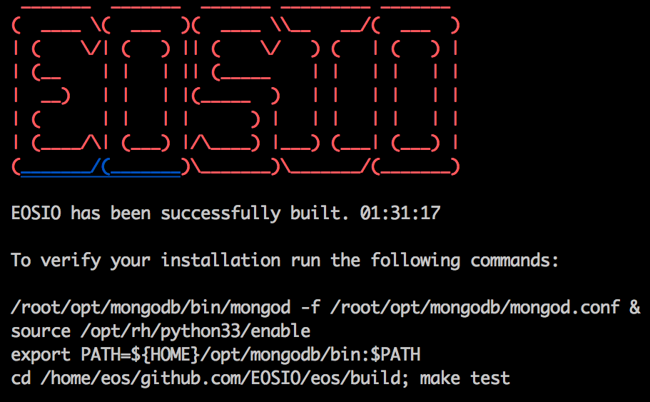

# 自建节点来测试剪影合约
最近（2018.08.xx) 关注EOS合约的无人不知ITE和剪影团队公布的游戏开源合约。如果想了解这些
游戏怎么运(zhuan)作(qian)，不如我们来自己搭建个测试节点，在测试节点上部署合约并模拟玩家
参与其中，来个沙盘演练。

## 1. 拉取nodeos代码
根据[官网文档](https://developers.eos.io/eosio-cpp/docs),拉取nodeos代码。

这里假设建立目录：

    mkdir github.com/EOSIO  -p

然后进入目录并拉取代码：

    cd github.com/EOSIO/
    git clone https://github.com/EOSIO/eos --recursive

这里“--recursive”的作用是拉取git工程里面的“.gitmodules”配置的依赖工程。拉取会耗很多时间，
因为里面的“llvm"和”boost"相对较大。如果过程中因为什么原因中断了，需要在eos目录下执行：

    git submodule update --init --recursive

这个过程视网络情况耗时不一，可能会非常久的时间。    

如果出现错误：
    
    perl: warning: Falling back to the standard locale ("C")

则需要设置：

    export LC_ALL=C

再行update重试。        

## 2. 安装相关依赖库
更新完代码后，进入到eos目录，然后执行build脚本，build脚本会先安装相应的依赖系统库：

    cd eos
    sh eosio_build.sh

过程中会询问是否下载安装依赖文件，选择“1”后，开始自动安装。 

    Do you wish to install and enable this repository, devtoolset-7 and Python3 packages?
    1) Yes
    2) No
    #? 1       

这些库包含了nodeos运行时依赖的动态库以及编译合约时用到的头文件，比如boost、fc等。    

## 3. 编译nodeos/cleos/eoscpp 等
上面执行了`sh eosio_build.sh`后，不仅会下载并安装依赖库，还会开始构建
nodeos、cleos、eoscpp等程序。在目录programs下依次会编译产生对应目录的二进制程序：
    
    .
    |-- cleos
    |-- eosio-abigen
    |-- eosio-launcher
    |-- keosd
    `-- nodeos

其中nodeos是节点服务器程序，cleos是命令行客户端程序，keosd是钱包管理程序。

当看到如下结果，恭喜你，编译成功了：

而目录tools目录下文件会编译生成eosipcpp、print_floats前者是用来编译合约的工具。

编译成功后，执行：
    
    sh eosio_install.sh
    
进行安装，这个脚本会把相关二进制程序和头文件以及库文件copy到目录：

    /usr/local/eosio

目录下，并设置 "~/.bash_profile"文件中的PATH环境变量，从而可以直接执行nodeos命令。

这里执行：

    nodeos -v
    v1.2.1

打印版本号，确定安装成功。

## 4. 运行nodeos节点
因为是在本地运行测试节点，因此不需要连接主网，也不用同步n大的block数据（截至2018.08.19有34G block内容)。先执行`nodeos`命令，然后通过"Ctrl+C"终止程序，nodeos会自动生成配置文件。
配置文件位于"~/.local/share/eosio/nodeos/config/config"。

这里我们创建目录：

    mkdir /home/nodeos
    mkdir /home/nodeos/config
    mkdir /home/nodeos/log
    mkdir /home/nodeos/data

然后到上面的nodeos目录下，将“~/.local/share/eosio/nodeos/config/config.ini”和copy到config目录。

默认的配置文件只是个同步节点，不是生成block的节点。这里修改配置文件中的：

    enable-stale-production = true
    producer-name = eosio

使得节点可以正常生产区块。

并在配置文件最后添加：

    plugin = eosio::chain_api_plugin
    plugin = eosio::history_api_plugin
    plugin = eosio::chain_plugin
    plugin = eosio::history_plugin
    plugin = eosio::net_plugin
    plugin = eosio::net_api_plugin

将这些插件带上。不同的插件对应不同的功能，这个在后续分析nodeos代码的时候会提到，这里只要加上即可。

然后运行：

    
    nodeos --contracts-console  --config /home/eos/nodeos/config/config.ini  --data-dir /home/eos/nodeos/data

指定config文件和block存储位置。这里 "--contracts-console"  会使得合约里面"print"可以打印到终端。

开始运行节点，打印的日志中会看到类似：

    2018-08-19T03:41:50.501 thread-0   producer_plugin.cpp:1295      produce_block        ] Produced block 0000000230037c59... #2 @ 2018-08-19T03:41:50.500 signed by eosio [trxs: 0, lib: 0, confirmed: 0]
    2018-08-19T03:41:51.000 thread-0   producer_plugin.cpp:1295      produce_block        ] Produced block 000000031933fd24... #3 @ 2018-08-19T03:41:51.000 signed by eosio [trxs: 0, lib: 2, confirmed: 0]
    2018-08-19T03:41:51.500 thread-0   producer_plugin.cpp:1295      produce_block        ] Produced block 000000044326e54f... #4 @ 2018-08-19T03:41:51.500 signed by eosio [trxs: 0, lib: 3, confirmed: 0]
    2018-08-19T03:41:52.000 thread-0   producer_plugin.cpp:1295      produce_block        ] Produced block 00000005105c590d... #5 @ 2018-08-19T03:41:52.000 signed by eosio [trxs: 0, lib: 4, confirmed: 0]

日志表示节点运行成功，并开始生成block

## 5. 部署系统合约
节点起来后，并不代表EOS就可以了，此时还没有账号、EOS币、RAM等概念。这些其实是在EOS这个
操作系统上跑的应用程序，只是他们是系统自带安装的。这里可以脑补下自己Windows电脑买回来
时上面已经装好了Word、Excel等。

因此我们要先给我们的系统安装好“Word"。

这里我们需要部署系统合约“eosio.bios"和"eosio.token"。

### 导入eosio的私钥
nodeos起来后，会生成一个内置的eosio账户，该账号的公私钥就在上面生成的配置文件中，找到：

    signature-provider =

然后通过命令行"cleos"工具创建钱包并导入私钥：

    # 1.2.x版本后，可以通过--file将密码存在文件中
    cleos wallet create -n eosio --file eosio.wallet

创建完钱包后导入私钥

    cleos wallet import -n eosio --private-key signature-provider-private-key

### eosio.bios
导入eosio账户私钥后，就可以通过该账号部署“eosio.bios"合约：

    cleos set contract eosio /home/eos/github.com/EOSIO/eos/build/contracts/eosio.bios/ -p eosio

这里利用了之前编译的时候生成的build目录下的构建好的合约。在上面的这个路径（假设按照前文所说的位置拉取代码），会有对应的wast和abi文件。

### eosio.token
EOS 发币相关逻辑在”eosio.token“合约中，在主网中这个合约的合约地址是：”eosio.token“.因此
这里我们也创建账户：

首先创建新用户的key：

    cleos create key --file eosio.token.key # 1.2.x之后增加了--file选项

将key存于文件中。    

    cleos create account eosio eosio.token EOS8b21prLC7CuhZJPt9m1CmEK1mmLjbQjVyr17Vrrc9b4WH1 EOS8b21prLC7CuhZJPt9m1CmEK1mmLjbQjVyr17Vrrc9b4WH1

这里讲owner和active都设置为上面生成的pubkey。

然后部署合约：

    set contract eosio.token /home/eos/github.com/EOSIO/eos/build/contracts/eosio.token -p eosio.token

部署好合约后，我们来测试下。

首先通过"eosio.token"发行EOS币：

    cleos push action eosio.token create '["eosio", "1000000000.0000 EOS", 0, 0, 0]' -p eosio.token

这样，eosio账户就有10亿EOS了。

然后创建两个账号bm和v.    

    cleos create key --file bm.key
    cleos create key --file v.key

    cleos wallet create -n bm --private-key "bm's private key"
    cleos wallet create -n v --private-key "v's private key"

    cleos create account eosio bm "bm's key" "bm's key"
    cleos create account eosio v "v's key" "v's key"

然后分别给这两个用户配100000个EOS。

    cleos push action eosio.token issue '["bm", "1000000.0000 EOS", "" ]' -p eosio
    cleos push action eosio.token issue '["v", "1000000.0000 EOS", "" ]' -p eosio

然后模拟bm给v转账10个EOS。

要转账，就需要私钥签名，而私钥签名是通过钱包来维护，所以这里我们要导入这两个账户的私钥到钱包里面：

    cleos wallet import -n bm --private-key "bm's private key"
    cleos wallet import -n v --private-key "v's private key"

然后开始转账：

    cleos push action eosio.token transfer '{"from":"bm","to":"v","quantity":"10.0000 EOS","memo":""}' -p bm

然后分别查看他们的余额：

    cleos get currency balance eosio.token bm
    999990.0000 EOS  
    cleos get currency balance eosio.token v
    1000010.0000 EOS        

## 6. 编译剪影合约

节点部署好了，我们就可以开始部署合约了。那合约在哪里呢？合约是由.wast的WebAssembly汇编
文件和.abi接口文件组成。.wast文件需要用eosiocpp编译.cpp文件来生成。这里我们需要
部署的是剪影的游戏合约。所以我们到剪影公布的合约代码仓库下载合约代码

    https://github.com/eosioshadows/eos-shadows

这里我们下载”eosioshadows.abi“和代码”eosioshadows.cpp“即可。 代码中有时间限制，因为
当前已经在此之后了，所以无需修改。

代码中的“TEAM_ACCOUNT”需要修改为已存在账号，比如"bm"。

这里我们先介绍一种较为快捷的编译合约方式，正统的合约开发要按照官方在1.2之后主推的
合约SDK:[eosio.wasmsdk](https://github.com/EOSIO/eosio.wasmsdk)。

这里在 "github.com/EOSIO/eos/contracts/”目录下新建"eosioshadows"目录。并将这两个文件
放入目录中。

然后在这个目录里面执行：

    eosiocpp -o eosioshadows.wast  eosioshadows.cpp 

编译产生对应的wast文件。这样我们就拥有了需要的eosioshadows.wast文件和
eosioshadows.abi文件。

如果提示找不到<eosiolib/core_symbol.hpp>需要将"build/construct/eosiolib/"下的这个文件
copy到"construct/eosiolib"目录下。

下面就可以通过之前部署系统合约的方式来部署剪影了。

## 7. 测试剪影合约
部署好了节点后，我就可以开始进行测试了。这里我们首先创建用于部署剪影合约的账号 eosisoshadows

    cleos create key --file eosioshadows.key
    cleos create account eosio eosioshadows "eosioshadows's key" "eosioshadows's key"

创建钱包并导入私钥：
    
    cleos wallet  create -n eosioshadows --file eosioshadows.wallet
    cleos wallet import -n eosioshadows --private-key "eosioshadows's private key"

然后附属eosisoshadows账号eosio.code的权限。这样eosisoshadows合约才可以转EOS给其他玩家。这一步是需要注意的，不能丢：

    cleos set account permission eosioshadows active '{"threshold": 1,"keys": [{"key": "eosioshadows's pub key","weight": 1}],"accounts": [{"permission":{"actor":"eosioshadows","permission":"eosio.code"},"weight":1}]}' owner -p eosioshadows

最后部署合约：

    cleos set contract eosioshadows /home/eos/github.com/EOSIO/eos/contracts/eosioshadows/ -p eosioshadows

部署好了之后就可以开始测试了：

### 模拟玩家bm打入100EOS
玩家打钱进入合约：

    cleos push action eosio.token transfer '{"from":"bm","to":"eosioshadows","quantity":"100.0000 EOS","memo":""}' -p bm
    executed transaction: 98c56e619cab473946d37fda03103581e82113e00ad9b0c75507da5ebb4afd93  128 bytes  1095 us
    #   eosio.token <= eosio.token::transfer        {"from":"bm","to":"eosioshadows","quantity":"100.0000 EOS","memo":""}
    #            bm <= eosio.token::transfer        {"from":"bm","to":"eosioshadows","quantity":"100.0000 EOS","memo":""}
    #  eosioshadows <= eosio.token::transfer        {"from":"bm","to":"eosioshadows","quantity":"100.0000 EOS","memo":""}

查看游戏Table:

    [root@iZwz9h3sf3c6lk7aov7kmkZ testnet]# cleos get table eosioshadows eosioshadows games
    {
      "rows": [{
          "i": 0,
          "k": 49751243,
          "e": 700000,
          "f": 100000,
          "w": 150000,
          "r": 50000,
          "d": 0
        }
      ],
      "more": false
    }

记录玩家的信息：

    cleos get table eosioshadows eosioshadows users
    {
      "rows": [{
          "n": "bm",
          "r": "",
          "e": 1000000,
          "k": 49751243,
          "p": 150000,
          "t": 1534690583
        }
      ],
      "more": false
    }

### 模拟玩家v打入10000EOS

此时玩家v再打入10000个EOS,模拟当前盘子为10000个EOS:

    cleos push action eosio.token transfer '{"from":"v","to":"eosioshadows","quantity":"10000.0000 EOS","memo":""}' -p v
    executed transaction: 4c9cfc679bc27b3c119aa88ef06ca0ef78ced4d1203a3ff050f942ded868bfe8  128 bytes  1242 us
    #   eosio.token <= eosio.token::transfer        {"from":"v","to":"eosioshadows","quantity":"10000.0000 EOS","memo":""}
    #        v <= eosio.token::transfer        {"from":"v","to":"eosioshadows","quantity":"10000.0000 EOS","memo":""}
    #  eosioshadows <= eosio.token::transfer        {"from":"v","to":"eosioshadows","quantity":"10000.0000 EOS","memo":""}

此时users表中记录：

    cleos get table eosioshadows eosioshadows users
    {
      "rows": [{
          "n": "bm",
          "r": "",
          "e": 1000000,
          "k": 49751243,
          "p": 15150000,
          "t": 1534690583
        },{
          "n": "v",
          "r": "bm",
          "e": 100000000,
          "k": 3301343316,
          "p": 0,
          "t": 1534690773
        }
      ],
      "more": false
    }

这里因为将上面讲源码TEAM改成了”bm"所以，默认上家是"bm"。表中有两个玩家的记录。

### 模拟玩家bm回收EOS

此时假设bm退出，看能得到多少回报：

    cleos push action eosioshadows sell '{"from":"bm", "quantity":"100.0000 EOS"}' -p cz
    executed transaction: 5d7a3facdb6c51737fb544b56d3475ff920a2055582c70446e173fea501dbe34  120 bytes  602 us
    #  eosioshadows <= eosioshadows::sell           {"from":"bm","quantity":"100.0000 EOS"}

这里根据abi中的接口，看到出售的命令，先换成EOS记录。然后再进行EOS兑换。

    cleos push action eosio.token transfer '{"from":"bm","to":"eosioshadows","quantity":"0.0001 EOS","memo":""}' -p cz
    executed transaction: 1c71404fcecc05efc8d900d508f1d133dd7de4aedf69e0c656e1eec3386c65cc  128 bytes  1910 us
    #   eosio.token <= eosio.token::transfer        {"from":"bm","to":"eosioshadows","quantity":"0.0001 EOS","memo":""}
    #            bm <= eosio.token::transfer        {"from":"bm","to":"eosioshadows","quantity":"0.0001 EOS","memo":""}
    #  eosioshadows <= eosio.token::transfer        {"from":"bm","to":"eosioshadows","quantity":"0.0001 EOS","memo":""}
    #   eosio.token <= eosio.token::transfer        {"from":"eosioshadows","to":"bm","quantity":"1517.5669 EOS","memo":"简影游戏团队感谢你的�...
    #  eosioshadows <= eosio.token::transfer        {"from":"eosioshadows","to":"bm","quantity":"1517.5669 EOS","memo":"简影游戏团队感谢你的�...
    #            bm <= eosio.token::transfer        {"from":"eosioshadows","to":"bm","quantity":"1517.5669 EOS","memo":"简影游戏团队感谢你的�...

这里看到，回打了1517个EOS。也就是100变1517.。。。。。

## 总结
这里以剪影这个游戏作为例子，主要演示了从源码构建一个nodeos开发环境，并用简单的方法编译合约；部署合约；测试合约。从而熟悉了解EOS合约的开发环境。

文中介绍的是一种1.1.x甚至dawin阶段编写合约的方法。在v1.2.x之后，官方将合约开发独立出来。主要
由"arryk85"主导的[eosio.wasmsdk](https://github.com/EOSIO/eosio.wasmsdk)来实现，未来这个方法才是正道之法。

