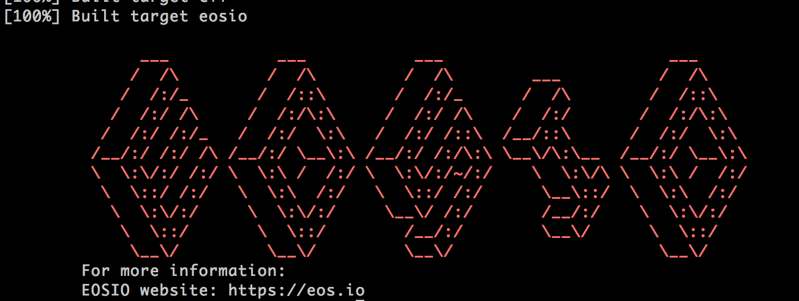

# 使用 WasmSDK 工具链

之前的文章中介绍了简单的配置合约开发的方法：[自建节点来测试剪影合约](https://www.jianshu.com/p/65e9057d2d85)。

那么如果我们没有自己的测试节点，或者说小伙伴给我们开放了API接口，但是我们自己没有运行nodeos的情况下要如何愉快的开发
合约呢？

答案就是[WasmSDK](https://github.com/EOSIO/eosio.wasmsdk)。 这个项目是[larryk85](https://github.com/larryk85)
发起的，将EOS只能合约C++开发工具链独立出EOS主库的项目。并且在官方EOS1.2.0的release note中提到：

在EOS 1.3以后将会废除EOS仓库里面的eosiocpp程序，也就是上面文章中介绍的方法将在1.3之后不可使用了。并且为了EOS仓库里也不会
出现"contracts/eosiolib"、 "contracts/libc++"、" contracts/musl"等合约 依赖的库文件。

所以在1.3还没有到来之前，赶紧一起来学习WasmSDK的使用。

## 编译安装

找到你自己喜欢位置，然后创建目录：

    mkdir -p github.com/eosio/ 
    cd github.com/eosio/

然后拉取WasmSDK的仓库代码：

    git clone --recursive https://github.com/eosio/eosio.wasmsdk
    cd eosio.wasmsdk

因为 WasmSDK 依赖了llvm项目，所以安装过程中需要clone llvm，整个库比较大（约1个G)。如果中途失败，可以用命令：

    git submodule update --recursive

重试几次。

拉取完成后，就可以执行 ：

    sh build.sh

进行安装了。

这个脚本会根据不同的操作系统，执行：

    scripts/
    ├── eosio_build_amazon.sh
    ├── eosio_build_centos.sh
    ├── eosio_build_darwin.sh
    ├── eosio_build_dep
    ├── eosio_build_fedora.sh
    └── eosio_build_ubuntu.sh    

下对应平台的sh文件。

这里的构建脚本会先检查相关工具是否安装，如果没有安装则进行下载安装。因为这里下载的路径是写死的，如果发现某个文件下载不了，或者下载过慢。
可以手动次改其下载地址。

比如这里发现cmake下载太慢，所以改成国内的镜像。

    // STATUS=$(curl -LO -w '%{http_code}' --connect-timeout 30 https://cmake.org/files/v3.10/cmake-3.10.2.tar.gz) 
    STATUS=$(curl -LO -w '%{http_code}' --connect-timeout 30 http://distfiles.macports.org/cmake/cmake-3.10.2.tar.gz)

这里注释了原来的官网源地址，替换成了镜像地址。如果有其他的包下载不下来，进行类似的替换即可。

脚本执行完后，会得到编译成功的界面：

然后到 执行：

    sh install.sh

会发现在目录/usr/local/eosio.wasmsdk/ 下按照好了SDK相关组件。

## SDK组成

我们来看下编译安装好的WasmSDK有哪些东西。

首先看/usr/local/eosio.wasmsdk/ 

    eosio.wasmsdk
    ├── bin
    ├── eosio.imports
    ├── include
    └── lib

包含这么几个目录，其中：

* bin: 构建工具二进制文件，比如eosiocpp
* eosio.imports: 空文件
* include： 编译依赖的头文件，比如eosiolib、boost、libc 等
* lib: 编译依赖的库文件。比如libc++.a、libeosio.a。还有cmake 的模块文件EosioWasmToolchain.cmake。

这里的EosioWasmToolchain.cmake是我们后面需要用到的，其中定义了编译构建工具位置、SDK头文件的位置，依赖的SDK库文件的位置。

从上面的SDK目录我们可以看到，要编写合约。首先要对eosiolib有所了解，这边介绍的eosiolib系列文章也主要是关注这个库。同时还需要了解
libc/libcxx也就是标准C函数和C++的STL函数（PS:eosio并不支持完整的C标准库函数，以及STL，比如在stdlib.h里面找不到rand函数。这也是
为什么SDK里面有单独的头文件目录，而不能用系统自带的标准库文件目录）以及boost工具。

## 测试构建例子

编译好了工具，我们可以用官方的例子测试下。

去到"github.com/EOSIO/eosio.wasmsdk/examples/hello"目录下。

修改CMakeList.txt文件中增加：

    list(APPEND CMAKE_MODULE_PATH "/usr/local/eosio.wasmsdk/lib/cmake/")

将之前的库里面的cmake moudle加载上。

然后执行：

    cmake CMakeList.txt

    cmake CMakeLists.txt
    -- Setting up Eosio Wasm Toolchain
    -- Configuring done
    -- Generating done
    -- Build files have been written to: /Users/apollo/Repos/github.com/EOSIO/eosio.wasmsdk/examples/hello

接着执行：

    make

    [ 50%] Building CXX object CMakeFiles/hello.dir/hello.cpp.o
    [100%] Linking CXX executable hello
    [100%] Built target hello

表示构建成功。并生成了 wasm文件 hello。

不过细心的观众可能会发现，这个工具和我们之前介绍的方法，少了两个文件，一个是abi文件。这个github上明确说了暂时还不支持，需要手动写或者用
之前的工具写。

> ABI generator (Coming Soon)

另外一个wast文件我也没搞明白，这里给k85提了issue [#49](https://github.com/EOSIO/eosio.wasmsdk/issues/49)。

## CMakeLists.txt

如果做过Android的JNI开发或者其他的嵌入式开发的话，会知道。toolchain其实是一套工具，我们只要按照规则写好makefile或者叫Android.mk就可以了。
make会自动根据规则去执行 跨平台编译，什么是跨平台编译，其实就是编译一个另一个架构平台上执行的机器码。比如在x86的windows编译手机arm cpu上可
执行的so。 

这里我们的Wasm SDK提供的工具链也是用类似的方式。我们只要写好CMakeLists.txt文件就可以了。剩下就交给cmake和make了。

类似Android.mk Android定义了协议模块工具和使用规则。这里我们上面提到的"EosioWasmToolchain.cmake"就是 SDK定义的规则。我们按照模板文件
github.com/EOSIO/eosio.wasmsdk/examples/template下的CMakeLists.txt来写就好了：

    cmake_minimum_required(VERSION 3.5)
    project(hello_example VERSION 1.0.0)

    # if no wasm root is given use default path
    if(EOSIO_WASMSDK_ROOT STREQUAL "" OR NOT EOSIO_WASMSDK_ROOT)
       set(EOSIO_WASMSDK_ROOT ${CMAKE_INSTALL_PREFIX})
    endif()

    # append the path to the module to include
    # or use list(APPEND CMAKE_MODULE_PATH "/usr/local/eosio.wasmsdk/lib/cmake/")
    list(APPEND CMAKE_MODULE_PATH ${EOSIO_WASMSDK_ROOT}/lib/cmake)

    #include the toolchain cmake
    include(EosioWasmToolchain)

上面的我都不用改，只要将 "project" 里面的工程名改成我们的就可以了。

在上面之后加上我们要构建二进制规则：

    add_executable( lol lol.cpp )
    target_include_directories( lol PUBLIC ${CMAKE_CURRENT_SOURCE_DIR}/ )

第一行将lol.cpp编译到lol文件中。第二行设置include文件目录为 "./" 。

如果熟悉cmake的话，这一切都是小儿科，如果不熟悉话，照着抄就可以了。

## 总结
WasmSDK是EOS提供的一套用来开发智能合约的SDK和编译的工具链。并且在v1.3后，原来的编译合约的方式将会被抛弃，所以我们需要早日熟悉起来这一套
工具来构建合约。

